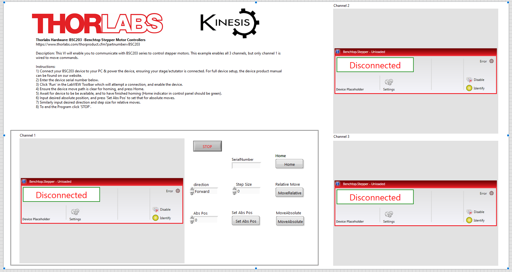
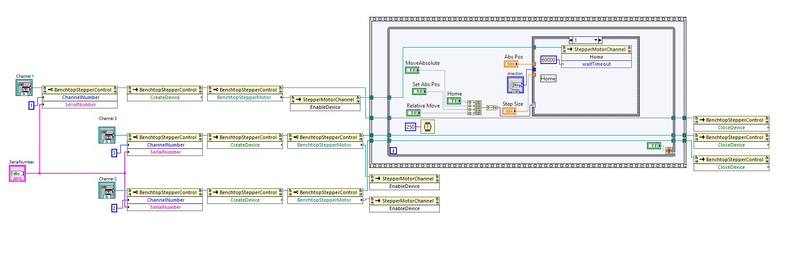

Thorlabs Hardware: BSC203 -Benchtop Stepper Motor Controllers
https://www.thorlabs.com/thorproduct.cfm?partnumber=BSC203

Description: This VI will enable you to communicate with BSC203 series to control stepper motors. This example enables all 3 channels, but only channel 1 is wired to move commands. 

Instructions: 
1) Connect your BSC203 device to your PC & power the device, ensuring your stage/actutator is connected. For full device setup, the device product manual can be found on our website.
2) Enter the device serial number below.
3) Click 'Run' in the LabVIEW Toolbar which will attempt a connection, and enable the device.
4) Ensure the device move path is clear for homing, and press Home.
5) Await for device to be be available, and to have finished homing (Home indicator in control panel should be green).
6) Input desired absolute position, and press 'Set Abs Pos' to set that for absolute moves.
7) Similarly input desired direction and step size for relative moves.
8) To end the Program click 'STOP'.

Tested on labVIEW 2023 Q1 64-bit.

### Front Panel

### Block Diagram
