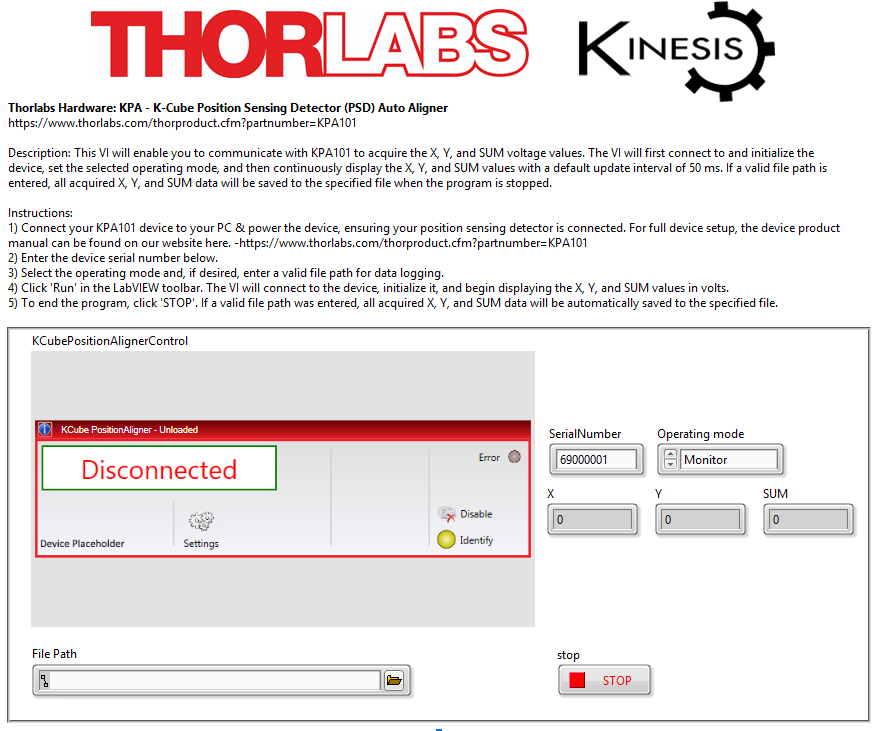
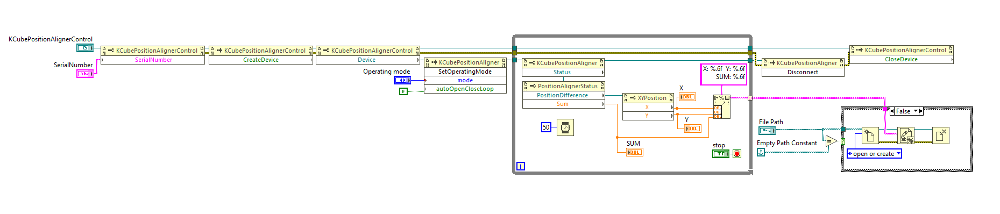

Thorlabs Hardware: KPA - K-Cube Position Sensing Detector (PSD) Auto Aligner  
https://www.thorlabs.com/thorproduct.cfm?partnumber=KPA101  

Description: This VI will enable you to communicate with KPA101 to acquire the X, Y, and SUM voltage values. The VI will first connect to and initialize the device, set the selected operating mode, and then continuously display the X, Y, and SUM values with a default update interval of 50 ms. If a valid file path is entered, all acquired X, Y, and SUM data will be saved to the specified file when the program is stopped.  

Instructions:  
1) Connect your KPA101 device to your PC & power the device, ensuring your position sensing detector is connected. For full device setup, the device product manual can be found on our website here. -https://www.thorlabs.com/thorproduct.cfm?partnumber=KPA101  
2) Enter the device serial number below.  
3) Select the operating mode and, if desired, enter a valid file path for data logging.  
4) Click 'Run' in the LabVIEW toolbar. The VI will connect to the device, initialize it, and begin displaying the X, Y, and SUM values in volts.  
5) To end the program, click 'STOP'. If a valid file path was entered, all acquired X, Y, and SUM data will be automatically saved to the specified file.  

Tested on labVIEW 2023 Q3 64-bit.  

### Front Panel

### Block Diagram
