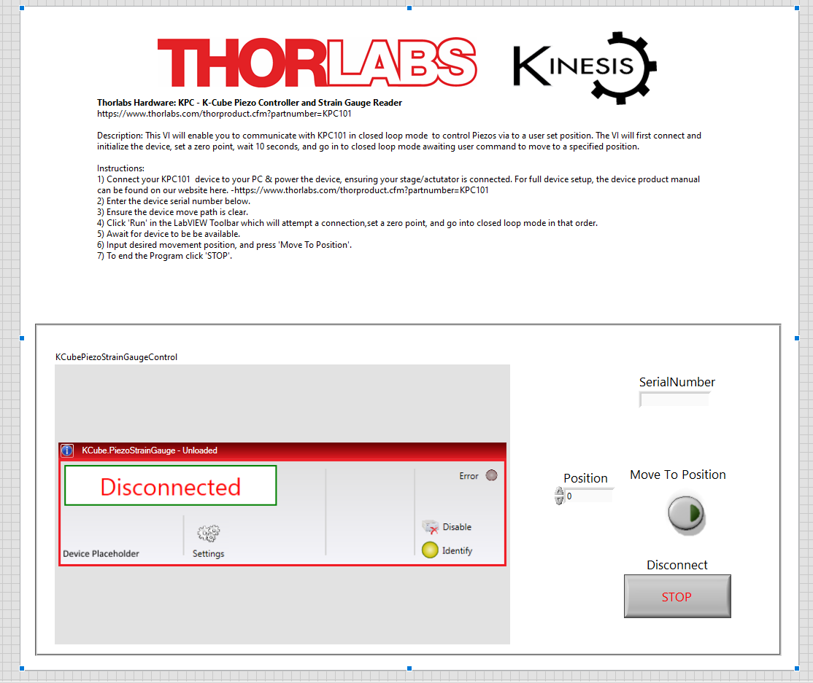
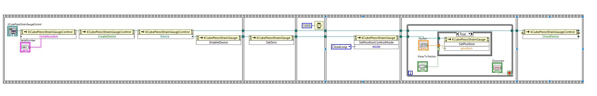

Thorlabs Hardware: KPC - K-Cube Piezo Controller and Strain Gauge Reader
https://www.thorlabs.com/thorproduct.cfm?partnumber=KPC101

Description: This VI will enable you to communicate with KPC101 in closed loop mode  to control Piezos via to a user set position. The VI will first connect and initialize the device, set a zero point, wait 10 seconds, and go in to closed loop mode awaiting user command to move to a specified position.

Instructions: 
1) Connect your KPC101  device to your PC & power the device, ensuring your stage/actutator is connected. For full device setup, the device product manual can be found on our website here. -https://www.thorlabs.com/thorproduct.cfm?partnumber=KPC101
2) Enter the device serial number below.
3) Ensure the device move path is clear.
4) Click 'Run' in the LabVIEW Toolbar which will attempt a connection,set a zero point, and go into closed loop mode in that order.
5) Await for device to be be available.
6) Input desired movement position, and press 'Move To Position'.
7) To end the Program click 

Tested on labVIEW 2023 Q1 64-bit.

### Front Panel

### Block Diagram
