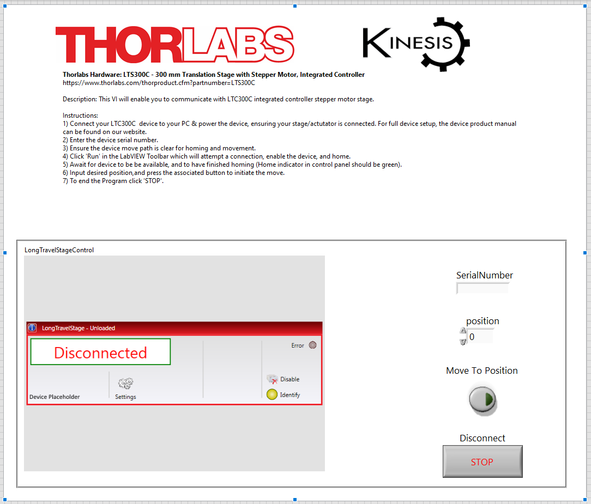
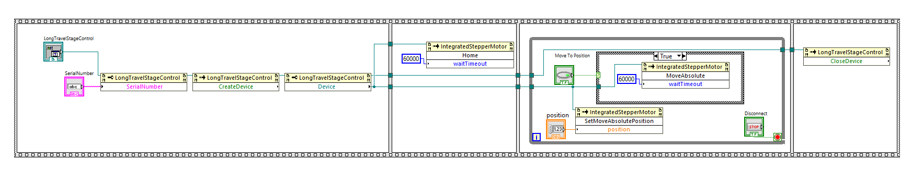

Thorlabs Hardware: LTS300C - 300 mm Translation Stage with Stepper Motor, Integrated Controller
https://www.thorlabs.com/thorproduct.cfm?partnumber=LTS300C

Description: This VI will enable you to communicate with LTC300C integrated controller stepper motor stage. 

Instructions: 
1) Connect your LTC300C  device to your PC & power the device, ensuring your stage/actutator is connected. For full device setup, the device product manual can be found on our website.
2) Enter the device serial number.
3) Ensure the device move path is clear for homing and movement.
4) Click 'Run' in the LabVIEW Toolbar which will attempt a connection, enable the device, and home.
5) Await for device to be be available, and to have finished homing (Home indicator in control panel should be green).
6) Input desired position,and press the associated button to initiate the move.
7) To end the Program click 'STOP'.

Tested on labVIEW 2023 Q1 64-bit.

### Front Panel

### Block Diagram
