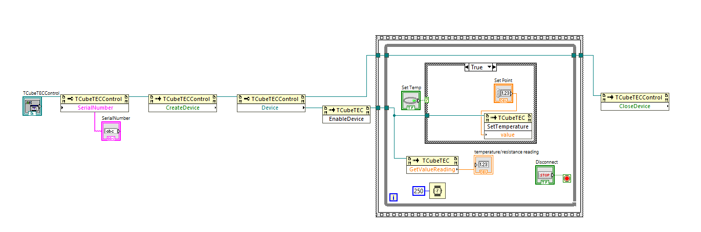

Thorlabs Hardware: TTC001 - T-Cube TEC Controller
https://www.thorlabs.com/thorproduct.cfm?partnumber=TTC001

Description: This VI will enable you to communicate with TTC001 to set a desired temperature and get live readings of current temperature. The VI will first connect and initialize the device, and waits for user command for the temperature set point.

Instructions: 
1) Connect your TTC001 device to your PC & power the device, ensuring your TEC is connected. For full device setup, the device product manual can be found on our website here. -https://www.thorlabs.com/thorproduct.cfm?partnumber=TTC001
2) Enter the device serial number below.
3) Click 'Run' in the LabVIEW Toolbar which will attempt a connection.
4) Await for device to be be available.
5) Input desired temperature, and press 'Set Temp'.
6) To end the Program click 'STOP'.

Tested on labVIEW 2023 Q1 64-bit.

### Front Panel

### Block Diagram
